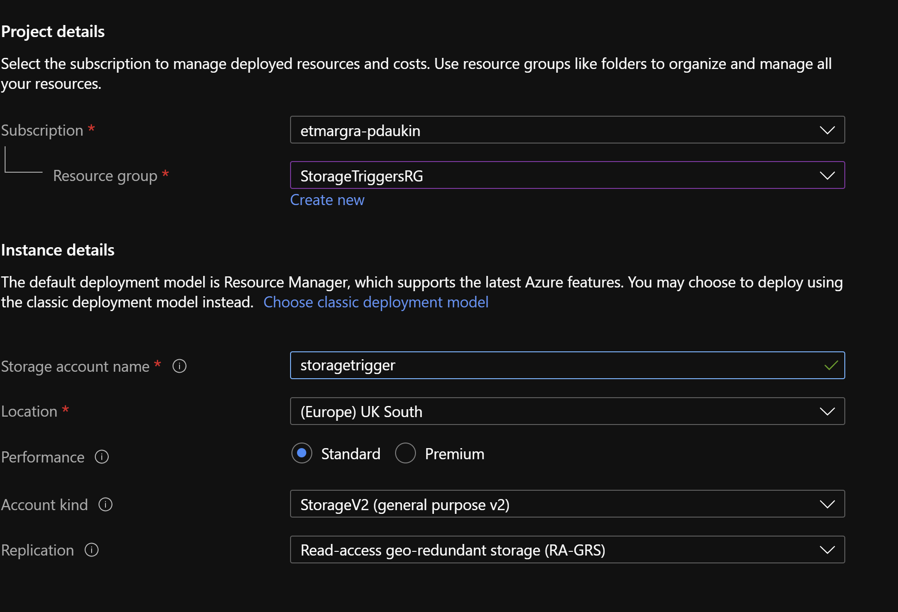
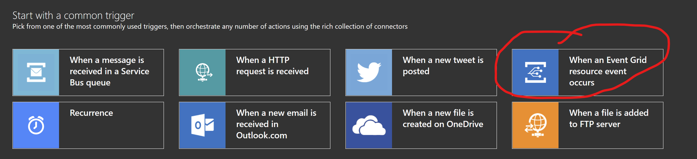

# Storage Triggers

Here we will examine some alternative mechanisms for initiating a cloud workflow in Azure. In some cases it will be obvious what the initiating event is and other times it will not be and factors such as cost, user experience, development and maintenance time, etc. will all need to be factored in to find the correct solution. When using Azure Functions or Azure Logic Apps it is possible to use a mechanism called a trigger to initiate a call to the function/LA. One type of trigger that can be utilised is known as a Blob Trigger which responds to when a file is dropped into Azure Blob Storage or if any of an existing Blob's properties are changed. When the trigger is activated the Logic App/Azure Function will be initiated.

However, it is important to note that this mechanism comes with some caveats: From the docs [here](https://docs.microsoft.com/en-us/azure/azure-functions/functions-bindings-storage-blob-trigger?tabs=csharp
)

> "If you require faster or more reliable blob processing, consider creating a queue message when you create the blob. Then use a queue trigger instead of a blob trigger to process the blob. Another option is to use Event Grid; see the tutorial Automate resizing uploaded images using Event Grid."


Each sample provides a mechanism to respond to a file being uploaded to Azure Blob Storage. The response will be to place a message onto a Azure Service bus instance and thus potentially trigger a workflow of some kind but that is left as an exercise for the reader:

## Blob Trigger

The BlobTrigger sample uses a standard BlobTrigger to start a Logic App. It is tempting just to reach for this but these triggers can take a long time to fire and that may not even happen at all. You can read more details about about how the BlobTrigger works [here](https://docs.microsoft.com/en-us/azure/azure-functions/functions-bindings-storage-blob-trigger?tabs=csharp).

In order to try this out we will create a Logic App that uses a BlobTrigger. The Logic App itself, once started will post a message to an Azure Service Bus and we could know that it is working as expected by viewing messages on the Service Bus Queue.


We are going to need a storage account so let's create that up front:

> We will use this storage account throughout and also we will place all resources into the same resource group.

Create a container in the Storage Account and call it `blob-trigger` (this is where we will upload the file to initiate the workflow).



Then, in the Azure Portal we can create our Logic App:


and configure it to use a Blob Trigger (note this is scoped to a container):


Next we can create a Service Bus using the portal. Again we will use this throughout to check that the flows are working. Once the Service Bus is created create a queue in the Service Bus namespace:


> You can view messages on a Service Bus using the portal but I prefer to use the [ServiceBusExplorer](https://github.com/paolosalvatori/ServiceBusExplorer) as it provides more features.
> Once this is in place you can add a Logic App Action to the previously created LA.


Where `send message` is a ServiceBus connector configured similar to below:


All that remains is to upload a file to the Blob Storage container, wait for a bit and then look at the service bus queue to see if there is a message:


> If something goes wrong and your message doesn't appear you can look in the `Runs History` on the Azure Portal and open a `run` and find out where the logic flow executed and see any associated errors. This shows what that looks like:


If you would like to deploy the Azure resources to your own subscription please click the following link the ensure you fill in the parameters according to their descriptions.

<a href="https://portal.azure.com/#create/Microsoft.Template/uri/https%3A%2F%2Fraw.githubusercontent.com%2Fpeted70%2Fstorage-triggers%2Fmain%2Fblob-trigger%2Ftemplate%2Ftemplate.json%3Ftoken%3DAAONK2LMWTLJ7HJJDP3QI5LALDFYW" target="_blank">
    
</a>

## Poll Blob

The polling version uses a recurrence trigger that fires on a schedule. When the trigger fires the Logic app will enumerate a storage container and check whether a specific property is set on a Blob's metadata.

> There currently isn't a built-in Blob Storage connector to retrieve the custom metadata so we have an Azure Function that does this job and is added to the Logic flow using an Azure Function connector.

This is what the code for the Azure Function looks like (without error handling and logging):

```C#
[FunctionName("CheckStorageMetadata")]
public static async Task<IActionResult> Run(
    [HttpTrigger(AuthorizationLevel.Anonymous, "get", "post", Route = null)] HttpRequest req,
    ILogger log)
{
    string requestBody = await new StreamReader(req.Body).ReadToEndAsync();
    dynamic data = JsonConvert.DeserializeObject(requestBody);

    string path = data.Path;
    var sections = path.Split('/', StringSplitOptions.RemoveEmptyEntries);

    string connectionString = Environment.GetEnvironmentVariable("STORAGE_CONN_STRING");
    string containerName = sections[0];
    string blobName = data.Name;

    BlobServiceClient client = new BlobServiceClient(connectionString);
    var bcb = client.GetBlobContainerClient(containerName);
    var bc = bcb.GetBlobClient(blobName);
    var props = await bc.GetPropertiesAsync();
    var hasCustomValue = props.Value.Metadata.TryGetValue(Key, out string status);

    if (!hasCustomValue)
    {
        await bc.SetMetadataAsync(new Dictionary<string, string> { { Key, "processing" } });
    }

    return new OkObjectResult(hasCustomValue ? status : "none");
}
```

The polling Logic app will then send a service bus message if the custom metadata value has not been previously set otherwise no other action will be taken.


## Event Grid

So, create a Logic App in the same way as before but this time use an event Grid Trigger:



Configure it similar to:


After dropping a file into storage and looking at the run it should look like this:

> Note that this works if you drop the file into any container in the storage account. We could put a filter onto the event so that we are only getting events from say, one container: (see [here](https://docs.microsoft.com/en-us/azure/storage/blobs/storage-blob-event-overview#filtering-events) for further details.


and again the resulting message on the Service Bus will look like this:


> In my experience of testing this there is no delay at all and also there are some [guarantees](https://azure.microsoft.com/en-us/support/legal/sla/event-grid/v1_0/#:~:text=We%20guarantee%20that%20Customers%20will,Grid%2099.99%25%20of%20the%20time.&text=If%20we%20do%20not%20achieve,of%20your%20monthly%20service%20fees.) around message delivery. Seems like this would be my default choice.

## Send Message

I think this discussion would not be complete without also considering whether you even need to detect a blob appearing in storage. For some scenarios it may not be the best thing to be responding to some kind of event, polling or trigger if the scenario itself lends itself to initiating the event. So, in this case we could start the whole sequence of events from an action taken on a web page or by running a command line application or similar. Just for completeness this is included here so we can reason about the implications.

> The sample included is a Blazor Server Web App which tracks the state of whether or not we have processed a file in the Blob Storage metadata and surfaces that status on the page. It also provides the ability to 'process' the file which is of course a no-op but will again send a message to the Service Bus and update the storage file's metadata.


The web app is very simple and the C# code for the page shown boils down to:

```C#
private IEnumerable<BlobFile> files;

protected override async Task OnInitializedAsync()
{
    files = await BlobService.GetFilesAsync();
}

public async Task SendMessage(BlobFile file)
{
    await BusService.SendMessageAsync(file);
    await BlobService.SetProcessedAsync(file);
    files = await BlobService.GetFilesAsync();
}
```

Which uses two services the BlobService and BusService.

> The BusService simply uses the [Azure.Messaging.ServiceBus SDK](https://github.com/Azure/azure-sdk-for-net/blob/Azure.Messaging.ServiceBus_7.1.1/sdk/servicebus/Azure.Messaging.ServiceBus/README.md) to send a message and the BlobService uses the [Azure.Storage.Blobs SDK](https://github.com/Azure/azure-sdk-for-net/blob/Azure.Storage.Blobs_12.8.0/sdk/storage/Azure.Storage.Blobs/README.md) to enumerate blobs in a container and read/write custom metadata to a blob.

Here's a snippet from the BlobService used to enumerate Blobs:

```C#
public async Task<IEnumerable<BlobFile>> GetFilesAsync()
{
    List<BlobFile> blobs = new List<BlobFile>();
    await foreach (BlobItem blob in _bcc.GetBlobsAsync())
    {
        var bc = _bcc.GetBlobClient(blob.Name);
        var bp = await bc.GetPropertiesAsync();

        var bf = new BlobFile();
        if (bp.Value.Metadata.TryGetValue(CustomKey, out string value))
        {
            bf.Status = value;
        }
        bf.Name = blob.Name;
        blobs.Add(bf);
    }
    return blobs;
}
```

and after 'processing' a file we can again check for the message on the Service Bus.


